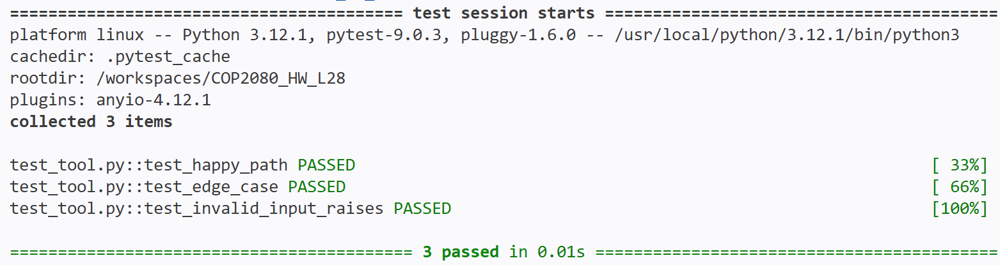

# COP2080_HW_L28
Tool name: irrigation_volume

Purpose: This tool computes the liters needed for a specific crop for commercial crop growth efficiently and economically with factors: the size of the land and the rate of water loss.

Installation: Use only standard python library

Usage: 
from tool import irrigation_volume
result = irrigation_volume(1000, 0.8, 4)
print(result) # output should be a dictionary containing the result in liters, unit(liters), and detail.

How This Fits the SNAP Project:
This tool can be integrated into a LangChain agent for providing quantitative results in agricultural applications. Especially when prompting the amount of water needed for a specific crop growth with other factors given.

